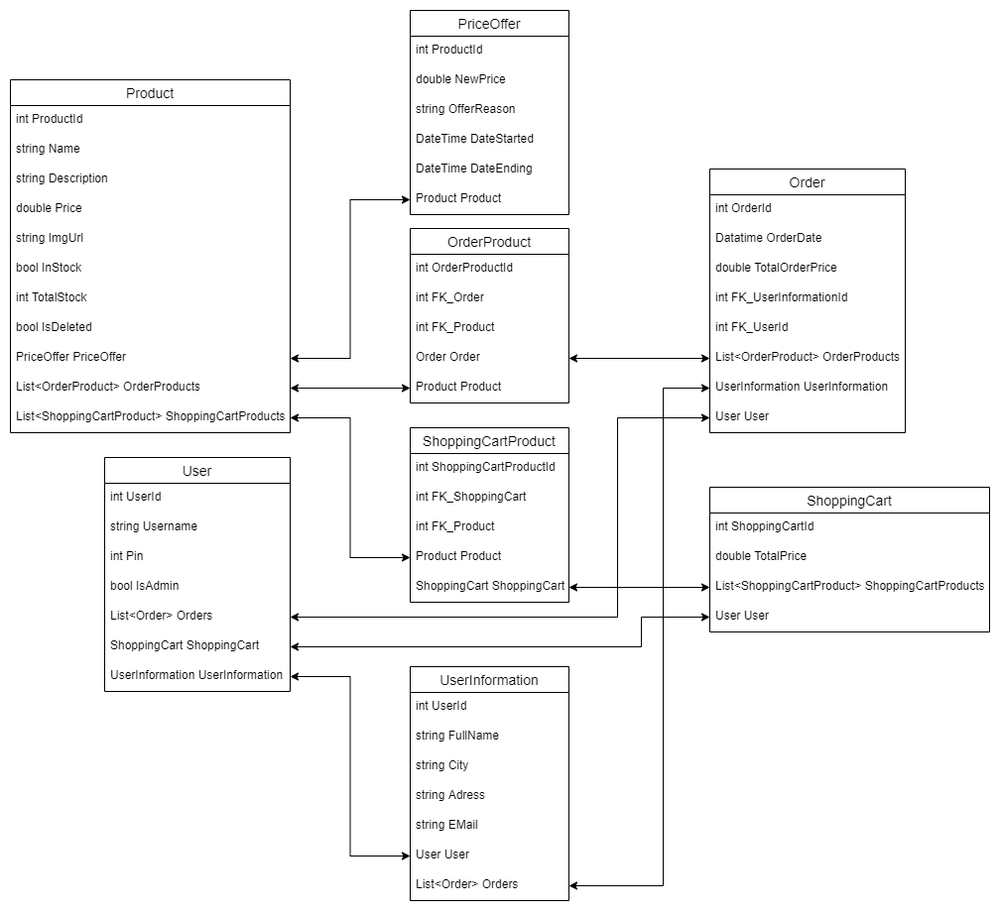

# EShop

## Introduction / Motivation

This website project is made for educational purposes, 
and the aim for the project is to build a website that can be used as a web shop.

## Technical Details

**FBT** : Folder By Type  
**FBF** : Folder By Feature  

|Project Name|Language|Folder Structure|
|-|-|-|
|*EShop.Repository*|*.NET 5.0*|*FBT*|
|*EShop.Service*|*.NET 5.0*|*FBT*|
|*EShop.Web*|*ASP.NET 5.0*|*FBF*| 

### Technologies and prerequisites

- [Visual Studio 2019 or newer](https://visualstudio.microsoft.com/vs/)
- [ASP.NET Core](https://docs.microsoft.com/en-us/aspnet/core/getting-started/?view=aspnetcore-2.1&tabs=windows&tabs=windows)
- [Entity Framework Core](https://docs.microsoft.com/en-us/ef/core/)
- [Razor Pages](https://www.learnrazorpages.com/)
- [Log4Net](https://logging.apache.org/log4net/)

## ER-Diagram

Not made yet  

## Implementation

Not made yet

## Class Diagrams

## Use of third party libraries

No one used

## Responsible People  
|Name|E-mail|Role|
|-|-|-|
|Nicklas Markvart Nielsen|1n2n3n4n5n@hotmail.dk|Developer, Product Owner|